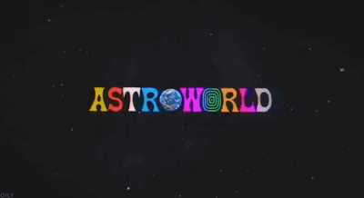

<!-- TITULO -->

### creative signal · distorted sound · digital chaos  
design · music · code

<!-- footer -->

<!-- GIF 1-->

<!-- Horizontal rule -->

## ◉ ＳＩＧＮＡＬ　ＭＡＮＩＦＥＳＴ

- sound before structure  
- visuals before rules  
- chaos with intention  
- late nights, loud ideas  

inspired by distortion · neon · future noise

<!-- Horizontal rule -->

## ◌ ＳＯＣＩＡＬ　ＬＩＮＫＳ

<!-- Horizontal rule -->

## ◈ ＣＲＥＡＴＩＶＥ　ＴＯＯＬＣＨＡＩＮ

<!-- Horizontal rule -->

## ⌬ ＤＡＷ　ＺＯＮＥ

<!-- Horizontal rule -->

## ⧉ ＤＥＶ　ＳＹＳＴＥＭ

<!-- Horizontal rule -->

## ⛶ ＩＮＦＲＡ　／　ＣＬＯＵＤ

<!-- Horizontal rule -->

## ⟁ ＳＹＳＴＥＭ　ＴＯＯＬＳ

<!-- Horizontal rule -->

## ⌁ ＳＩＧＮＡＬ　ＦＬＯＷ

<!-- Horizontal rule -->

## ⦿ ＳＹＳＴＥＭ　ＴＥＬＥＭＥＴＲＹ

<!-- Horizontal rule -->

<!-- GIF 2-->

⚠️ Experimental zone · Distorted aesthetics ·Volume up

explicit signals · distorted sound · creative chaos

<!-- Parental -->

